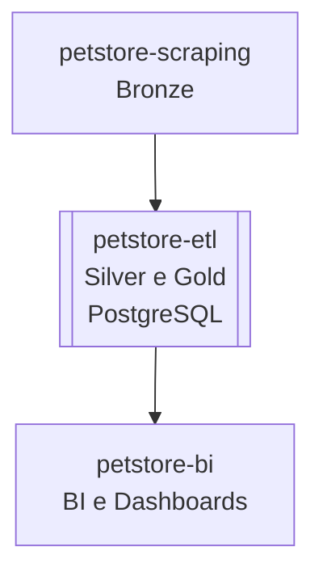

# 🐾 petstore-etl

Projeto responsável pela **extração, transformação e carga (ETL)** de dados coletados pelo projeto [`petstore-scraping`](https://github.com/rafa-trindade/petstore-scraping).  

Esta etapa compõe as camadas **Silver e Gold** da arquitetura de dados, realizando **limpeza, padronização, enriquecimento e carga no PostgreSQL**.

Os dados tratados e carregados no **PostgreSQL** nesse projeto serão consumidos pelo projeto [`petstore-bi`](https://github.com/rafa-trindade/petstore-bi) para BI e Dashboards.

---

## 📌 Descrição

O `petstore-etl` consome os dados brutos (camada Bronze) gerados pelo [`petstore-scraping`](https://github.com/rafa-trindade/petstore-scraping) e executa as seguintes camadas:

* **🟤 Extractc (Bronze):** coleta dos arquivos brutos disponibilizados pelo [`petstore-scraping`](https://github.com/rafa-trindade/petstore-scraping) via link público (raw).  
* **⚪ Transform (Silver):** limpeza, padronização e enriquecimento dos dados, incluindo preenchimento de endereços e coordenadas geográficas.
* **🟡 Load (Gold):** integração final e carga no banco de dados, preparando os dados para análise e visualização no [`petstore-bi`](https://github.com/rafa-trindade/petstore-bi).

---

## 📊 Estrutura dos Dados e Metadados

As principais colunas tratadas e enriquecidas (incluindo latitude e longitude) são:

| Coluna        | Tipo   | Descrição                   | Valores possíveis / Observações | Unidade | Camada          | Origem       | Última Atualização |
| ------------- | ------ | --------------------------- | ------------------------------- | ------- | --------------- | ------------ | ------------------ |
| id            | string | Identificador único da loja | Sequencial (autoincrement)      | -       | Silver / Gold   | petstore-etl | 2025-10-06         |
| empresa       | string | Nome da rede                | Petz, Cobasi, Petlove...        | -       | Silver / Gold   | petstore-etl | 2025-10-06         |
| nome          | string | Nome da loja                | -                               | -       | Silver / Gold   | petstore-etl | 2025-10-06         |
| logradouro    | string | Logradouro simplificado     | -                               | -       | Silver / Gold   | petstore-etl | 2025-10-06         |
| bairro        | string | Bairro                      | -                               | -       | Silver / Gold   | petstore-etl | 2025-10-06         |
| cidade        | string | Cidade                      | -                               | -       | Silver / Gold   | petstore-etl | 2025-10-06         |
| estado        | string | Sigla do estado             | SP, RJ, MG...                   | -       | Silver / Gold   | petstore-etl | 2025-10-06         |
| cep           | string | CEP normalizado             | 00000-000                       | -       | Silver / Gold   | petstore-etl | 2025-10-06         |
| latitude      | float  | Latitude geográfica         | -90 a 90                        | graus   | Silver / Gold   | petstore-etl | 2025-10-06         |
| longitude     | float  | Longitude geográfica        | -180 a 180                      | graus   | Silver / Gold   | petstore-etl | 2025-10-06         |
| data_extracao | date   | Data da extração do dado    | YYYY-MM-DD                      | -       | Silver / Gold   | petstore-etl | 2025-10-06         |

---

## 🧩 Fluxo de Dados



---

## 📊 Estrutura do Projeto Final

| Repositório | Função | Camada | Principais Tecnologias |
| ----------------- | ----------------------------- | ------------------ | -------------------------------------- |
| [`petstore-scraping`](https://github.com/rafa-trindade/petstore-scraping) | Coleta de Dados de Franquias | 🟤 Bronze | Selenium, BeautifulSoup4, lxml, pandas |
| [`petstore-etl`](https://github.com/rafa-trindade/petstore-etl) | Limpeza, Padronização e Carga | ⚪ Silver / 🟡 Gold | pandas, brazilcep, requests, numpy, tabulate, SQLAlchemy, psycopg2-binary, python-dotenv |
| [`petstore-bi`](https://github.com/rafa-trindade/petstore-bi) | BI e Dashboards | 📊 BI | Streamlit, Plotly, pandas |

---

## ⚙️ Tecnologias e Bibliotecas `petstore-etl`

* [**pandas**](https://pypi.org/project/pandas/) → manipulação e estruturação de dados tabulares  
* [**requests**](https://pypi.org/project/requests/) → chamadas HTTP para APIs externas  
* [**numpy**](https://pypi.org/project/numpy/) → operações numéricas e vetoriais  
* [**tabulate**](https://pypi.org/project/tabulate/) → exibição de tabelas no terminal de forma legível  
* [**SQLAlchemy**](https://pypi.org/project/SQLAlchemy/) → conexão e manipulação de bancos de dados SQL de forma programática  
* [**psycopg2-binary**](https://pypi.org/project/psycopg2-binary/) → driver PostgreSQL para Python  
* [**python-dotenv**](https://pypi.org/project/python-dotenv/) → leitura de variáveis de ambiente a partir de arquivos `.env`


O projeto utiliza a API **CEP Aberto** para obter informações de **latitude e longitude**, além de preencher campos ausentes de endereço (logradouro, bairro, cidade, estado, cep).

> Identificação da aplicação: `USER_AGENT = "petstore-etl/1.0"`

---

## 🖥️ Log de Execução `petstore-etl`

```text
----------------------------------------------
- Camada Bronze - Extraindo Dados...
----------------------------------------------
Extraindo de petstore-scraping/main/data/bronze/lojas_bronze.csv

- Processo concluído. Arquivo salvo em: data\bronze\lojas_bronze.csv

----------------------------------------------
- Camada Silver / Gold - Padronizando Dados...
----------------------------------------------
Processando (1/533): Petz - Petz Abelardo Bueno
Processando (2/533): Petz - Petz Aclimação
Processando (3/533): Petz - Petz Afonso Pena
Processando (4/533): Petz - Petz Agamenon
Processando (5/533): Petz - Petz Águas Claras
...
Processo concluído. Arquivo salvo em: data\gold\lojas_gold.csv

----------------------------------------------
- Load - Carregando no Banco de Dados...
----------------------------------------------
1. Iniciando processo de carga...
2. Tabela 'lojas_gold' verificada/criada com sucesso.
3. Constraint única verificada/criada.
4. Dados carregados na tabela temporária 'lojas_gold_staging'.
--- Registros antes da carga: 0
--- Registros depois da carga: 533
5. Dados mesclados na tabela 'lojas_gold' com sucesso.
6. Processo de carga concluído com sucesso!
7. Dados carregados com sucesso no PostgreSQL.

```
🔗 [Ver log completo](https://raw.githubusercontent.com/rafa-trindade/petstore-etl/refs/heads/main/logs/log.txt)

---

## 🔗 Integração com Projeto de BI

Os dados carregados no **PostgreSQL** pelo **`petstore-etl`** devem ser consumidos pelo projeto **`petstore-bi`** para BI e Dashboards.

---

## 🗄️ Tabela Temporária `lojas_gold_staging`

- Durante o processo de carga, os dados do CSV são inseridos nessa tabela temporária.  
- Em seguida, é feito o **UPSERT** para a tabela principal `lojas_gold`, garantindo que não haja duplicatas.  
- Ao final da execução, a tabela `lojas_gold_staging` é **removida automaticamente**, garantindo que apenas os dados finais permaneçam na tabela principal.

---

## 🏪 Redes Suportadas

Atualmente, o projeto coleta e trata dados das seguintes redes:

* **Petz**
* **Cobasi**
* **Petlove**
