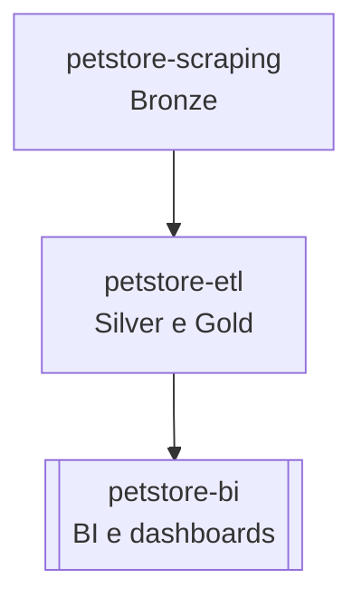

# 🐾 petstore-etl

Projeto responsável pela **extração, transformação e carga (ETL)** de dados coletados pelo repositório `petstore-scraping`.  
Esta etapa compõe as camadas **Silver e Gold** da arquitetura de dados, realizando **limpeza, padronização, enriquecimento e carga no banco de dados**.

---

## 📌 Descrição

O `petstore-etl` consome os dados brutos (camada Bronze) gerados pelo `petstore-scraping` e executa as seguintes etapas:

* **Extract:** coleta dos arquivos brutos disponibilizados pelo `petstore-scraping` via link público (raw).  
* **Transform (Silver):** limpeza, padronização e enriquecimento dos dados, incluindo preenchimento de endereços e coordenadas geográficas.  
* **Load (Gold):** integração final e carga no banco de dados, preparando os dados para análise e visualização no `petstore-bi`.

---

## 📊 Estrutura dos dados

As principais colunas tratadas e enriquecidas são:

| empresa | nome | logradouro | bairro | cidade | estado | cep | latitude | longitude |
| ------- | ---- | ---------- | ------ | ------ | ------ | --- | -------- | --------- |

---

## 🧩 Fluxo de Dados

---

## 🌐 API de Geolocalização

O projeto utiliza a API **Nominatim (OpenStreetMap)** para obter informações de **latitude e longitude**, além de preencher campos ausentes de endereço (logradouro, bairro, cidade, estado).  

> Identificação da aplicação: `USER_AGENT = "petstore-etl/1.0"`

---

## ⚙️ Tecnologias e bibliotecas

* [**pandas**](https://pypi.org/project/pandas/) → manipulação e estruturação de dados tabulares  
* [**brazilcep**](https://pypi.org/project/brazilcep/) → padronização de logradouros, bairros, cidade e estado  
* [**requests**](https://pypi.org/project/requests/) → chamadas HTTP para APIs externas  

---

## 🚀 Possíveis usos

* Preenchimento automático de CEPs, endereços e coordenadas de lojas.  
* Geração de datasets prontos para análise geográfica e regional.  
* Alimentação de dashboards e pipelines de BI no projeto `petstore-bi`.
