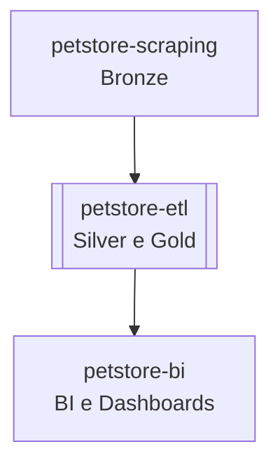

# 🐾 petstore-etl

Projeto responsável pela **extração, transformação e carga (ETL)** de dados coletados pelo projeto [`petstore-scraping`](https://github.com/rafa-trindade/petstore-scraping).  

Esta etapa compõe as camadas **Silver e Gold** da arquitetura de dados, realizando **limpeza, padronização, enriquecimento e carga no banco de dados**.

Os dados tratados nesse projeto serão consumidos pelo projeto [`petstore-bi`](https://github.com/rafa-trindade/petstore-bi) para BI e Dashboards.

---

## 📌 Descrição

O `petstore-etl` consome os dados brutos (camada Bronze) gerados pelo [`petstore-scraping`](https://github.com/rafa-trindade/petstore-scraping) e executa as seguintes camadas:

* **🟤 Extractc (Bronze):** coleta dos arquivos brutos disponibilizados pelo [`petstore-scraping`](https://github.com/rafa-trindade/petstore-scraping) via link público (raw).  
* **⚪ Transform (Silver):** limpeza, padronização e enriquecimento dos dados, incluindo preenchimento de endereços e coordenadas geográficas.  
* **🟡 Load (Gold):** integração final e carga no banco de dados, preparando os dados para análise e visualização no `petstore-bi`.

---

## 📊 Estrutura dos Dados

As principais colunas tratadas e enriquecidas (incluindo latitude e longitude) são:

| empresa | nome | logradouro | bairro | cidade | estado | cep | latitude | longitude |
| ------- | ---- | ---------- | ------ | ------ | ------ | --- | -------- | --------- |

---

## 🧩 Fluxo de Dados



---

## 🏪 Redes Suportadas

Atualmente, o projeto coleta dados das seguintes redes:

* **Petz**
* **Cobasi**
* **Petlove**

---

## ⚙️ Tecnologias e Bibliotecas

* [**pandas**](https://pypi.org/project/pandas/) → manipulação e estruturação de dados tabulares  
* [**brazilcep**](https://pypi.org/project/brazilcep/) → padronização de logradouros, bairros, cidade e estado  
* [**requests**](https://pypi.org/project/requests/) → chamadas HTTP para APIs externas

O projeto utiliza a API **Nominatim (OpenStreetMap)** para obter informações de **latitude e longitude**, além de preencher campos ausentes de endereço (logradouro, bairro, cidade, estado).  

> Identificação da aplicação: `USER_AGENT = "petstore-etl/1.0"`

---

## 🖥️ Log de Execução

```text
----------------------------------------------
- Camada Bronze - Extraindo Dados...
----------------------------------------------
Extraindo de petstore-scraping/main/data/bronze/lojas_bronze.csv

- Processo concluído. Arquivo salvo em: data\bronze\lojas_bronze.csv

----------------------------------------------
- Camada Silver - Transformando Dados...
----------------------------------------------
Processado 1/533: petz - Petz Abelardo Bueno
Processado 2/533: petz - Petz Aclimação
Processado 3/533: petz - Petz Afonso Pena
Processado 4/533: petz - Petz Agamenon
Processado 5/533: petz - Petz Águas Claras
...
Processo concluído. Arquivo salvo em: data\silver\lojas_silver.csv

----------------------------------------------
- Camada Gold - Padronizando Dados...
----------------------------------------------
>> type(df): <class 'pandas.core.frame.DataFrame'>
>> shape: (533, 9)
>> colunas: ['empresa', 'nome', 'logradouro', 'bairro', 'cidade', 'estado', 'cep', 'latitude', 'longitude']
>> colunas de endereço garantidas no DataFrame.
>> 515 CEP(s) únicos encontrados para consulta (ex.: ['22775-040' '01534-000' '79005-671' '50050-290' '71928-720'])
[1/515] 22775-040 -> {'logradouro': 'Avenida Embaixador Abelardo Bueno', 'bairro': 'Barra da Tijuca', 'cidade': 'Rio de Janeiro', 'estado': 'RJ'}
[2/515] 01534-000 -> {'logradouro': 'Rua Muniz de Sousa', 'bairro': 'Aclimação', 'cidade': 'São Paulo', 'estado': 'SP'}
[3/515] 79005-671 -> {'logradouro': 'Avenida Bandeirantes', 'bairro': 'Amambaí', 'cidade': 'Campo Grande', 'estado': 'MS'}
[4/515] 50050-290 -> {'logradouro': 'Avenida Governador Agamenon Magalhães', 'bairro': 'Boa Vista', 'cidade': 'Recife', 'estado': 'PE'}
[5/515] 71928-720 -> {'logradouro': 'Avenida Sibipiruna', 'bairro': 'Sul (Águas Claras)', 'cidade': 'Brasília', 'estado': 'DF'}
...
>> Campo 'logradouro' preenchido com base no CEP.
>> Campo 'bairro' preenchido com base no CEP.
>> Campo 'cidade' preenchido com base no CEP.
>> Campo 'estado' preenchido com base no CEP.
>> Preenchimento concluído com sucesso!
         cep                             logradouro                                    bairro          cidade estado
0  22775-040      Avenida Embaixador Abelardo Bueno                           Barra da Tijuca  Rio de Janeiro     RJ
1  01534-000                     Rua Muniz de Sousa                                 Aclimação       São Paulo     SP
2  79005-671                   Avenida Bandeirantes                                   Amambaí    Campo Grande     MS
3  50050-290  Avenida Governador Agamenon Magalhães                                 Boa Vista          Recife     PE
4  71928-720                     Avenida Sibipiruna                        Sul (Águas Claras)        Brasília     DF
5  01419-001                         Alameda Santos                           Cerqueira César       São Paulo     
...

Processo concluído. Arquivo salvo em: data\gold\lojas_gold.csv
```
🔗 [Ver log completo](logs/log.txt)

---

## 🔗 Integração com Projeto de BI

Os arquivos gerados na pasta `data/gold/` devem ser consumidos pelo projeto **`petstore-bi`** BI e Dashboards.
