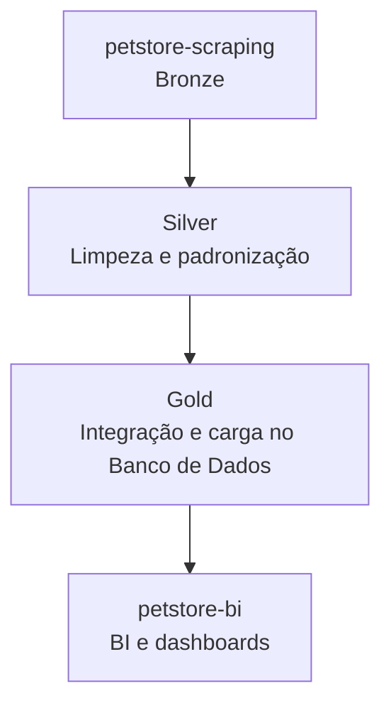

# 🐾 petstore-transform-load

Projeto responsável pela **transformação e carga** de dados coletados pelo `petstore-scraping`.
Esta etapa compõe as camadas **Silver e Gold** da arquitetura de dados, realizando **limpeza, padronização, enriquecimento e carga no banco de dados**.

---

## 📌 Descrição

O `petstore-transform-load` consome os dados brutos (camada Bronze) gerados pelo `petstore-scraping` e realiza os seguintes processos:

* **Silver:** limpeza, padronização e enriquecimento dos dados, incluindo preenchimento de endereços e coordenadas geográficas.
* **Gold:** integração final dos dados prontos para análise, estruturados e carregados no banco de dados.

Os arquivos resultantes podem ser consumidos pelo repositório `petstore-bi` para análises e dashboards.

---

## 📊 Estrutura dos dados

As principais colunas tratadas são:

| empresa | nome | logradouro | bairro | cidade | estado | cep | latitude | longitude |
| ------- | ---- | ---------- | ------ | ------ | ------ | --- | -------- | --------- |

---

## 🧩 Fluxo de Dados

---

## 🌐 API de Geolocalização

O projeto utiliza a API **Nominatim (OpenStreetMap)** para obter informações de latitude, longitude e tratamento de dados faltantes.

---

## ⚙️ Tecnologias e bibliotecas

* [**pandas**](https://pypi.org/project/pandas/) → manipulação e estruturação de dados tabulares
* [**brazilcep**](https://pypi.org/project/brazilcep/) → padronização de logradouros, bairros, cidade e estado
* [**requests**](https://pypi.org/project/requests/) → chamadas HTTP para APIs externas
* [**time**](https://docs.python.org/3/library/time.html) → controle de pausas entre requisições

---

## 🚀 Possíveis usos

* Preencher automaticamente CEPs, endereços e coordenadas de lojas.
* Gerar datasets prontos para análise geográfica e regional.
* Alimentar dashboards e pipelines de BI.
