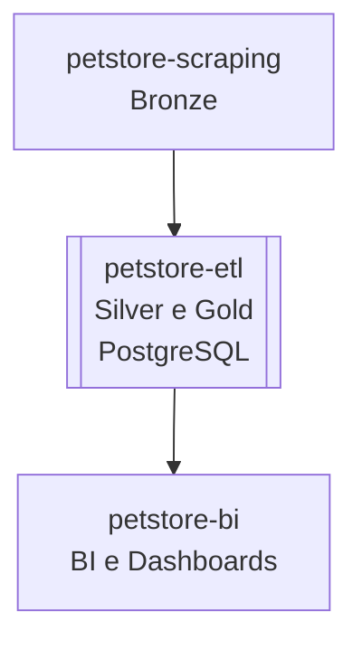

# 🐾 petstore-etl

Projeto responsável pela **extração, transformação e carga (ETL)** de dados coletados pelo projeto [`petstore-scraping`](https://github.com/rafa-trindade/petstore-scraping).  

Esta etapa compõe as camadas **Silver e Gold** da arquitetura de dados, realizando **limpeza, padronização, enriquecimento e carga no PostgreSQL**.

Os dados tratados e carregados no **PostgreSQL** nesse projeto serão consumidos pelo projeto [`petstore-bi`](https://github.com/rafa-trindade/petstore-bi) para BI.

---

## 📌 Descrição:

O `petstore-etl` consome os dados brutos (camada Bronze) gerados pelo [`petstore-scraping`](https://github.com/rafa-trindade/petstore-scraping) e executa as seguintes camadas:

* **🟤 Extractc (Bronze):** coleta dos arquivos brutos disponibilizados pelo [`petstore-scraping`](https://github.com/rafa-trindade/petstore-scraping) via link público (raw).  
* **⚪ Transform (Silver):** enriquecimento dos dados, adicionando novas colunas com dados do IBGE.
* **🟡 Load (Gold):** limpeza, padronização dos dados para carga dataset no banco de dados deixando-os disponíveis para análise e visualização no [`petstore-bi`](https://github.com/rafa-trindade/petstore-bi).

---

## 📊 Estrutura dos Dados e Metadados:

As principais colunas tratadas e enriquecidas são:

| Coluna                      | Tipo    | Descrição                         | Valores possíveis / Observações             | Unidade | Camada        | Origem              | Última Atualização |
| --------------------------- | ------- | --------------------------------- | ------------------------------------------- | ------- | ------------- | ------------------- | ------------------ |
| empresa                     | string  | Nome da rede                      | Petz, Cobasi, Petlove...                    | -       | Silver / Gold | petstore-etl        | 2025-10-08         |
| nome                        | string  | Nome da loja                      | -                                           | -       | Silver / Gold | petstore-etl        | 2025-10-08         |
| logradouro                  | string  | Logradouro simplificado           | -                                           | -       | Silver / Gold | petstore-etl        | 2025-10-08         |
| bairro                      | string  | Bairro                            | -                                           | -       | Silver / Gold | petstore-etl        | 2025-10-08         |
| cidade                      | string  | Cidade                            | -                                           | -       | Silver / Gold | petstore-etl        | 2025-10-08         |
| estado                      | string  | Sigla do estado                   | SP, RJ, MG...                               | -       | Silver / Gold | petstore-etl        | 2025-10-08         |
| regiao                      | string  | Região da cidade                  | Norte, Sul, Sudeste, Centro-Oeste, Nordeste | -       | Silver / Gold | IBGE / petstore-etl | 2025-10-08         |
| populacao                   | integer | População estimada da cidade      | Número inteiro                              | pessoas | Silver / Gold | IBGE / petstore-etl | 2025-10-08         |
| cep                         | string  | CEP normalizado                   | 00000-000                                   | -       | Silver / Gold | petstore-etl        | 2025-10-08         |
| latitude                    | float   | Latitude geográfica               | -90 a 90                                    | graus   | Silver / Gold | petstore-etl        | 2025-10-08         |
| longitude                   | float   | Longitude geográfica              | -180 a 180                                  | graus   | Silver / Gold | petstore-etl        | 2025-10-08         |
| renda_domiciliar_per_capita | float   | Renda domiciliar média (estadual) | Valores monetários                          | R$      | Silver / Gold | IBGE / petstore-etl | 2025-10-08         |
| cidade_cod_ibge             | string  | Código IBGE da cidade             | 7 dígitos, conforme IBGE                    | -       | Silver / Gold | IBGE / petstore-etl | 2025-10-08         |
| data_extracao               | date    | Data da extração do dado          | YYYY-MM-DD                                  | -       | Silver / Gold | petstore-etl        | 2025-10-08         |
---

## 🧩 Fluxo de Dados



---

## 📊 Estrutura Geral do Projeto:

| Repositório | Função | Camada | Principais Tecnologias |
| ----------------- | ----------------------------- | ------------------ | -------------------------------------- |
| [`petstore-scraping`](https://github.com/rafa-trindade/petstore-scraping) | Coleta de Dados de Franquias | 🟤 Bronze | Selenium, BeautifulSoup4, lxml, pandas |
| [`petstore-etl`](https://github.com/rafa-trindade/petstore-etl) | Limpeza, Padronização e Carga | ⚪ Silver / 🟡 Gold | requests, SQLAlchemy, pandas, Cep Aberto (API) |
| [`petstore-bi`](https://github.com/rafa-trindade/petstore-bi) | BI e Dashboards | 📊 BI | Streamlit, Plotly, pandas |

---

## ⚙️ Tecnologias e Bibliotecas `petstore-etl`:

* [**pandas**](https://pypi.org/project/pandas/) → manipulação e estruturação de dados tabulares  
* [**requests**](https://pypi.org/project/requests/) → chamadas HTTP para APIs externas  
* [**tabulate**](https://pypi.org/project/tabulate/) → exibição de tabelas no terminal de forma legível  
* [**SQLAlchemy**](https://pypi.org/project/SQLAlchemy/) → conexão e manipulação de bancos de dados SQL de forma programática  
* [**psycopg2-binary**](https://pypi.org/project/psycopg2-binary/) → driver PostgreSQL para Python  
* [**python-dotenv**](https://pypi.org/project/python-dotenv/) → leitura de variáveis de ambiente a partir de arquivos `.env`

O projeto utiliza a API **CEP Aberto** para obter informações de **latitude e longitude**, além de preencher campos ausentes de endereço (logradouro, bairro, cidade, estado, cep).

---

## 🖥️ Log de Execução `petstore-etl`:

```text
============================================================
- CAMADA BRONZE - Extraindo Dados...
============================================================

- Processo concluído. Arquivo salvo em: data\bronze\lojas_bronze.csv

Dimensão: 902 linhas x 10 colunas

🔹 Categóricas (object/category) (10 colunas):
['empresa', 'nome', 'endereco', 'bairro', 'cidade', 'estado', 'cep', 'latitude', 'longitude', 'data_extracao'] 

Valores nulos por coluna:
|    | Coluna    |   Nulos | % Nulos   |
|----|-----------|---------|-----------|
|  5 | estado    |      22 | 2.44%     |
|  6 | cep       |      31 | 3.44%     |
|  7 | latitude  |     692 | 76.72%    |
|  8 | longitude |     692 | 76.72%    |


============================================================
- CAMADA SILVER - Enriquecendo Dataset...
============================================================

- Processo concluído. Arquivo salvo em: data\silver\lojas_silver.csv

Dimensão: 902 linhas x 14 colunas

🔹 Numéricas (2 colunas):
['renda_domiciliar_per_capita', 'cod_cidade'] 

🔹 Categóricas (object/category) (12 colunas):
['empresa', 'nome', 'logradouro', 'bairro', 'cidade', 'estado', 'regiao', 'cep', 'populacao', 'latitude', 'longitude', 'data_extracao'] 

Valores nulos por coluna:
|    | Coluna                      |   Nulos | % Nulos   |
|----|-----------------------------|---------|-----------|
|  1 | nome                        |       1 | 0.11%     |
|  2 | logradouro                  |      51 | 5.65%     |
|  3 | bairro                      |     312 | 34.59%    |
|  4 | cidade                      |      22 | 2.44%     |
|  5 | estado                      |      22 | 2.44%     |
|  6 | regiao                      |      22 | 2.44%     |
|  7 | cep                         |      31 | 3.44%     |
|  8 | populacao                   |      22 | 2.44%     |
|  9 | latitude                    |     692 | 76.72%    |
| 10 | longitude                   |     692 | 76.72%    |
| 11 | renda_domiciliar_per_capita |      22 | 2.44%     |
| 12 | cod_cidade                  |      22 | 2.44%     |


============================================================
- CAMADA GOLD - Padronizando Dados...
============================================================
- Processo concluído. Arquivo salvo em: data\gold\lojas_gold.csv

Dimensão: 902 linhas x 14 colunas

🔹 Numéricas (2 colunas):
['renda_domiciliar_per_capita', 'cod_cidade'] 

🔹 Categóricas (object/category) (12 colunas):
['empresa', 'nome', 'logradouro', 'bairro', 'cidade', 'estado', 'regiao', 'cep', 'populacao', 'latitude', 'longitude', 'data_extracao'] 

Valores nulos por coluna:
|    | Coluna                      |   Nulos | % Nulos   |
|----|-----------------------------|---------|-----------|
|  1 | nome                        |       1 | 0.11%     |
|  2 | logradouro                  |      42 | 4.66%     |
|  3 | bairro                      |      70 | 7.76%     |
|  4 | cidade                      |      22 | 2.44%     |
|  5 | estado                      |      22 | 2.44%     |
|  6 | regiao                      |      22 | 2.44%     |
|  7 | cep                         |      31 | 3.44%     |
|  8 | populacao                   |      22 | 2.44%     |
|  9 | latitude                    |      47 | 5.21%     |
| 10 | longitude                   |      47 | 5.21%     |
| 11 | renda_domiciliar_per_capita |      22 | 2.44%     |
| 12 | cod_cidade                  |      22 | 2.44%     |


============================================================
- LOAD - Carregando no Banco de Dados...
============================================================
1. Iniciando processo de carga...
2. Tabela 'lojas_gold' verificada/criada com sucesso.
3. Constraint única verificada/criada.
4. Dados carregados na tabela temporária 'lojas_gold_staging'.
--- Registros antes da carga: 0
--- Registros depois da carga: 902
5. Dados mesclados na tabela 'lojas_gold' com sucesso.
6. Processo de carga concluído com sucesso!
7. Dados carregados com sucesso no PostgreSQL.
```
🔗 [Ver log completo](https://raw.githubusercontent.com/rafa-trindade/petstore-etl/refs/heads/main/logs/log.txt)

---

## 🔗 Integração com Projeto de BI:

Os dados carregados no **PostgreSQL** pelo **`petstore-etl`** devem ser consumidos pelo projeto **`petstore-bi`** para BI e Dashboards.

---

## 🗄️ Tabela Temporária `lojas_gold_staging`:

- Durante o processo de carga, os dados do CSV são inseridos nessa tabela temporária.  
- Em seguida, é feito o **UPSERT** para a tabela principal `lojas_gold`, garantindo que não haja duplicatas.  
- Ao final da execução, a tabela `lojas_gold_staging` é **removida automaticamente**, garantindo que apenas os dados finais permaneçam na tabela principal.

---

## 🏪 Redes Analisadas:

Atualmente, o projeto coleta dados públicos das seguintes redes para estudo:

* **Cobasi**
* **Pet Camp**
* **Petland**
* **Petlove**
* **Petz**
* **Pop Pet Center**